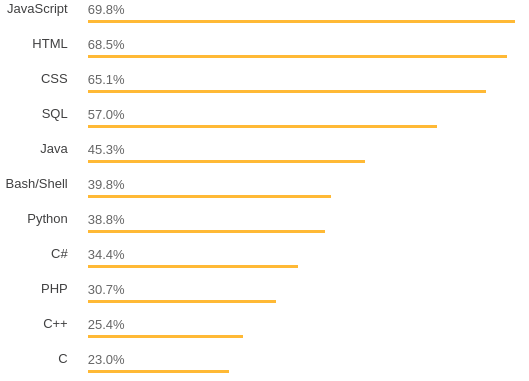

---

## C++ from Python
-- A Report from the trenches --

Peter Steinbach   
(steinbach@scionics.de, [@psteinb_](https://twitter.com/psteinb_) )  
C++UG Dresden, June 12, 2018 

---

## Agenda

1. __Why__
2. __How__ (simple)
3. __How__ (for real)

---

## __Why__ other languages?

+++?image=img/laptop-at-night.jpeg&size=cover

<div style="color: white; background-color: rgb(0, 102, 102,0.75);border-radius: 25px;padding: 20px;">
Reinvent the wheel over-and-over?
</div>

+++?image=img/diverse-shoes.jpeg&size=cover

### Teams/Communities are diverse.

+++?image=img/weights.jpeg

### C++ is for the heavy lifting or latency bound tasks!

+++

## Python is dynamic

```python
$ python3                  
Python 3.6.5 (default, Apr  4 2018, 15:01:18) 
# ...
>>> i = 42
>>> print(i)
42
>>> i = "forty-two"
>>> print(i)
```

Note:
- Chiasm currently: py2 vs. py3
- py = dynamically typed

+++

## Python Manages Memory

```python
>>> tlist = [1,3,5,6]
>>> def foo(alist):
        value = list()
        value.extend(alist)
        alist.extend([11,22])
        return alist
>>> alist = foo(tlist)
>>> print(alist)
[1, 3, 5, 6, 11, 22]
```

Note:
- py = managed memory (reference counting)

+++

## Python Is Modular

```python
>>> import numpy
>>> a = numpy.zeros((10,))
>>> b = numpy.ones((10,))
>>> print(a+b)
array([ 1.,  1.,  1.,  1.,  1.,  1.,  1.,  1.,  1.,  1.])
```

Note:
- batteries included
- `numpy` very popular in data science and HPC

+++

## Python Is Popular



Top 11 Languages in [2018 Stackoverflow Developer Survey](https://insights.stackoverflow.com/survey/2018/)

Note:
- more use of C++ through integration with python

---

## How to interface?
(simple version)

+++

### A simple goal

```python
>>> import mymath
>>> mymath.add(2,3)
5.0
```

+++

### C/C++ Extension API to CPython

```c
//mymath.c
#include "Python.h"

static struct PyModuleDef mymathmodule = {
   PyModuleDef_HEAD_INIT,
   “mymath", /* name of module */
   "My documentation of mymath“, 
   /* module documentation, may be NULL */
   -1, /* size of per-interpreter module state,
          or -1 if the module keeps 
          state in global variables. */
   MyMethods
};

PyMODINIT_FUNC PyInit_mymath(void){
    return PyModule_Create(&mymathmodule);
}
```

Note:
*Only creating the module*

+++

### Extension API: Methods

```c
//mymath.c continued

static PyMethodDef MyMethods[] = {
{"add", module_function, METH_VARARGS, "Adds two numbers"},
{NULL, NULL, 0, NULL}
};

```

Note:
Populate the methods table

+++

### Extension API: Doing Math!

```c
//mymath.c continued

static PyObject* module_function(PyObject *self, PyObject *args){
    float a, b, c;
    if (!PyArg_ParseTuple(args, "ff", &a, &b)){
        return NULL;
    }
    
    c = a + b;
    
    return Py_BuildValue("f", c);
}
```

Note:
Finally we do some work!

+++?image=img/902px-Punishment_sisyph.jpg&size=auto 80%

<div style="color: white; margin-top: 60%;margin-left: 80%;font-size: 14px">
Titian, <a href="https://commons.wikimedia.org/wiki/File:Punishment_sisyph.jpg">Sisyphus</a>
</div>

+++

### Not Enough? Exporting a `struct`

```c
typedef struct {
    PyObject_HEAD
    PyObject *first; /* first name */
    PyObject *last;  /* last name */
    int age;
} PersonObject;

```

+++

### Doing Garbage Collection

```c
static void
Custom_dealloc(CustomObject *self)
{
    Py_XDECREF(self->first);
    Py_XDECREF(self->last);
    Py_TYPE(self)->tp_free((PyObject *) self);
}

static PyObject *
Custom_new(PyTypeObject *type, PyObject *args, PyObject *kwds)
{
    CustomObject *self;
    self = (CustomObject *) type->tp_alloc(type, 0);
    if (self != NULL) {
        self->first = PyUnicode_FromString("");
        if (self->first == NULL) {
            Py_DECREF(self);
            return NULL;
        }
        self->last = PyUnicode_FromString("");
        if (self->last == NULL) {
            Py_DECREF(self);
            return NULL;
        }
        self->age = 0;
    }
    return (PyObject *) self;
}
```

+++?image=img/old_tools.jpeg&size=cover

### Better Tools? 

Note:
- pure C API very verbose
- some information encoded in function name
- very C like interface

---

## How to interface?
(the 21st century version)

+++?image=img/pybind11-logo.png&size=70% auto

<div style="color: white; margin-top: 50%;font-size: 1.5em">

[github.com/pybind/pybind11](https://github.com/pybind/pybind11)

</div>

Note:
- 3.5k stars
- 500 forks

+++

### pybind11

> pybind11 is a lightweight header-only library that exposes C++ types in Python and vice versa

@ul

- Python 2.7, 3.x, and PyPy (PyPy2.7 >= 5.7) support
- header-only without dependencies
- Clang/LLVM 3.3 or newer, GCC 4.8 or newer, Microsoft Visual Studio 2015 Update 3 or newer, Intel C++ compiler 17 or newer, Cygwin/GCC
- BSD 3-clause license

@ulend

+++

### `mymath` revisited

```c++
//pybind11_math.cpp
#include <pybind11/pybind11.h>

int add(int i, int j) {
    return i + j;
}

namespace py = pybind11;

PYBIND11_MODULE(mymath,m) {
    m.doc() = "pybind11 math module";
    m.def("add", &add,"A function which adds two numbers");
}

```

+++

### PyBind11 embraces C++ developers

```cmake
cmake_minimum_required(VERSION 2.8.12)
project(mymath)

add_subdirectory(pybind11)
#the above adds cmake functionality specific to pybind11
pybind11_add_module(cmake_example src/main.cpp)
```

see [github.com/pybind/cmake_example](https://github.com/pybind/cmake_example)


Note:
- template project brings `setup.py` along
- easy integration of python-side unit testing etc

+++?image=img/happy.jpeg&size=cover

### Awesome!

Note:
- pybind leverages a lot of the common day tasks 

+++

### Syntactic Sugar while binding

```c++
int add(int i = 41, int j = 1) {
    return i + j;
}

namespace py = pybind11;

PYBIND11_MODULE(mymath,m) {
    m.doc() = "pybind11 math module";
    m.def("add", &add, "A function which adds two numbers",
      py::arg("i") = 1, py::arg("j") = 2);
    //requires 'using namespace pybind11::literals;'
    //m.def("add", &add, "i"_a=1, "j"_a=2);
}
```
+++

### A `Person` again

```c++

struct Person {
    std::string name = "";
    int age = 0;

    Pet(const std::string &name) : 
        name(name), 
        age(age) { }
    
    void setName(const std::string &name_) { name = name_; }
    const std::string &getName() const { return name; }
    
    //...

};

```

+++

### Binding a `Person`

```c++
#include <pybind11/pybind11.h>

namespace py = pybind11;

PYBIND11_MODULE(example, m) {
    py::class_<Person>(m, "Person")
        .def(py::init<const std::string &>())
        .def("setName", &Person::setName)
        .def("getName", &Person::getName);
}
```
+++

### Make a `Person` pythonesque

```python
>>> print(p)
<example.Person object at 0x10cd98060>
```

```c++
py::class_<Person>(m, "Person")
    .def(py::init<const std::string &>())
    .def("setName", &Person::setName)
    .def("getName", &Person::getName)
    .def("__repr__",
        [](const Person &a) {
            return "<example.Person named '" + a.name + "'>";
        }
    );
```

```python
>>> print(p)
<example.Person named 'Molly'>
```
+++

### Inheritance?

```c++
struct Person {
    Person(const std::string &name) : name(name) { }
    std::string name;
};

struct Coder : Person {
    Coder(const std::string &name) : Person(name) { }
    std::string work() const { return "Doh!"; }
};

```
+++

### Python <3 Inheritance

```c++
PYBIND11_MODULE(example, m) {
py::class_<Person>(m, "Person")
   .def(py::init<const std::string &>())
   .def_readwrite("name", &Person::name);

// Method 1: template parameter:
py::class_<Coder, 
           Person /* parent type! */>(m, "Coder")
    .def(py::init<const std::string &>())
    .def("work", &Coder::work);
    
```

```python
>>> p = example.Coder('Molly')
>>> p.name
u'Molly'
>>> p.work()
u'Doh!'
```

+++

### Python Objects

```c++
void print_dict(py::dict dict) {
    /* Easily interact with Python types */
    for (auto item : dict)
        std::cout << "key=" << std::string(py::str(item.first)) 
                  << ", "
                  << "value=" << std::string(py::str(item.second)) 
                  << std::endl;
}

PYBIND11_MODULE(mymath,m) {
m.def("print_dict", &print_dict);
}

```

```python
>>> from mymath import print_dict
>>> print_dict({'foo': 123, 'bar': 'hello'})
key=foo, value=123
key=bar, value=hello
```

+++?image=img/city-man-person-lights.jpg&size=cover

<div style="color: white; margin-top: 60%">
There is a lot more to see:
</div>

[pybind11.readthedocs.io](http://pybind11.readthedocs.io/en/master/index.html)

## Discussion and Summary

+++


### What I didn't discuss

- [Boost.Python](http://boostorg.github.io/python/doc/html/index.html)
- [swig](http://www.swig.org/)
- [ctypes](https://docs.python.org/3/library/ctypes.html) / [cffi](http://cffi.readthedocs.io/en/latest/)

Note:
- Boost: viral install (!= `vcpkg`/`conan`)
- Boost: active development?
- swig: nice for simple stuff, not flexible enough
- ctypes: code overhead due to casting in python
- cffi: c code in python strings?

+++

### pybind11

- open-source python bindings from C++ and vice verse
- very active community and good documentation
- very mature covering 80-90% of use cases

#### [github.com/pybind/pybind11](https://github.com/pybind/pybind11)

+++

###
